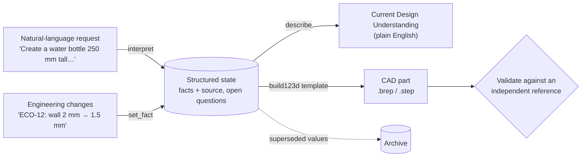
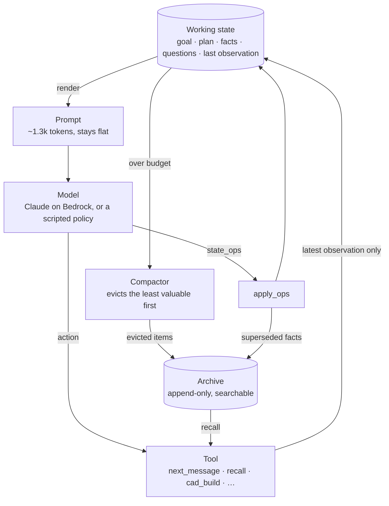
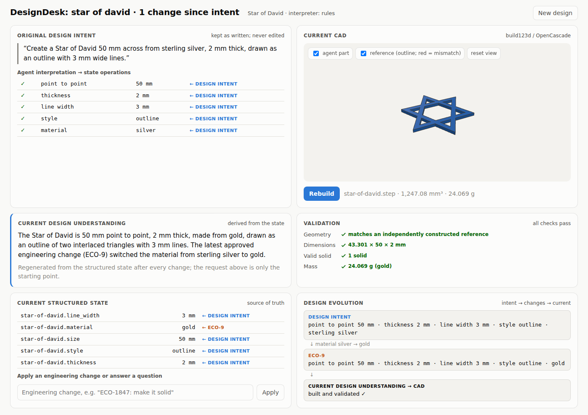
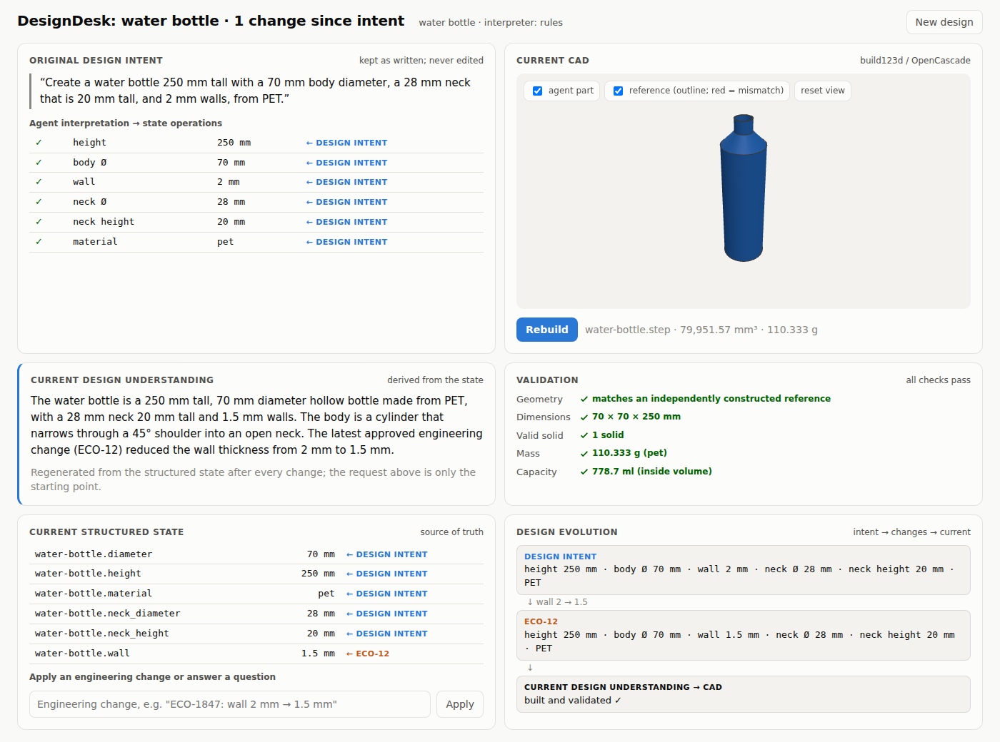

# LongHorizonAgent (LHA): state, not history

**History grows. State doesn't have to.**

LHA is an agent architecture for runs that last thousands of steps, plus a **CAD agent** built on it.
The agent turns a plain-English design request into a structured state, then keeps that state current
through thousands of engineering changes. It writes **build123d** (OpenCascade) scripts that produce real
3D parts, and every part is checked against an independently built reference.

The idea is simple. Most agents append every step to the prompt, so the prompt grows until it becomes
too expensive or too long, and stale facts sit next to current ones. LHA drops the transcript. The model
sees only a small **working state** and edits it with explicit operations. Anything it no longer needs is
moved to a searchable **archive**, and the model can recall it later.

| at 3,000 messages | LHA (stateful) | naive transcript |
|---|---:|---:|
| peak prompt, DesignDesk (CAD) | **1,335 tokens** | 161,302 tokens |
| total input tokens | **1.5%** of naive | 100% |


## Contents

- [Quick start](#quick-start)
- [Architecture](#architecture)
- [Screens](#screens)
- [Designing from a request](#designing-from-a-request)
- [Benchmarks](#benchmarks)
- [Live runs on AWS Bedrock](#live-runs-on-aws-bedrock)
- [Commands](#commands)
- [Project layout](#project-layout)
- [Updating your local copy](#updating-your-local-copy)
- [Limitations](#limitations)
- [Full reference](docs/REFERENCE.md)

---

## Quick start

Requires Python 3.10+. No API key is needed for anything in this section.

```bash
git clone https://github.com/somul18/LongHorizonAgent_v1.git
cd LongHorizonAgent_v1
pip install -e ".[dev,aws,cad]"
pytest -q                                                      # expect: 53 passed

python -m lha.ui                                               # the dashboard: http://127.0.0.1:8765
python -m lha.bench.run --env design --sizes 1000 --inspect    # watch a 1,000-message run in the terminal
```

In the dashboard, pick an example (*Water bottle*, *Cross*, *Star of David*, a mounting plate, …), then
click **Create Design** and **Build CAD**.

---

## Architecture

### The design flow

A design moves through four stages. The **structured state is the only source of truth**. The
plain-English understanding and the CAD part are both derived from it, and are regenerated after every
change.



- **Interpret** (`lha/intent.py`, `lha/families.py`). Each value the request states becomes a `set_fact`
  tagged `← DESIGN INTENT`. Each value it leaves out becomes an open question. Nothing is guessed, and
  the part can't be built until every question is answered.
- **Change.** An engineering change overwrites a fact (tagged `← ECO-…`), and the old value goes to the archive.
- **Describe** (`lha/describe.py`). A pure function of the state. No model call is involved, and nothing
  is stored, so the description can't drift from the facts.
- **Build and validate** (`lha/cad.py`, `lha/design_session.py`). The part is built from a parametric
  build123d template. It is then compared with a reference built a different way, on geometry,
  dimensions, a valid solid and mass.

### The long-horizon agent loop

The same state machinery runs the agent over thousands of steps:



1. **Render.** The working state becomes the prompt. It is the model's only view of the past.
2. **Decide.** The model replies with state operations (`set_fact`, `pin`, `add_task`, `add_question`, …)
   and one tool call.
3. **Apply.** `set_fact` overwrites a fact, and the old value is archived, so a stale value never sits
   next to the current one.
4. **Compact.** Over budget, the compactor evicts in order: notes, old observations, closed tasks, then
   least-recently-used unpinned facts. Evicted keys stay listed, so the model knows what it can recall.
5. **Checkpoint.** The state is saved after every step. Kill the run and start it again with the same
   `--run-id`, and it continues from the same step.

### Components

| module | role |
|---|---|
| `state.py`, `compactor.py`, `archive.py` | working state and its operations, token budget, archive and recall (BM25) |
| `agent.py`, `llm.py`, `tools.py` | stateful agent, naive baseline, model clients (Bedrock, OpenAI-compatible, scripted), tools |
| `intent.py`, `families.py`, `design_session.py`, `describe.py` | design flow: request → state → understanding → CAD |
| `cad.py` | build123d tools: `cad_build`, `cad_measure`, `cad_export` (STEP/STL), geometry matching |
| `bench/` | the IncidentDesk and DesignDesk benchmarks, plus the runner |
| `inspect.py`, `ui/` | terminal inspector, and the web dashboard (stdlib server + three.js viewer) |

---

## Screens

The dashboard (`python -m lha.ui`) has three tabs: **Memory inspector** (with *Design intent* and
*Replay a run* modes), **Benchmarks** and **CAD parts**.

### 1. New design

Describe a part in plain English, or click an example.


### 2. A design from intent

The request and how it was read, the 3D part over its reference, the current understanding, validation,
the structured state with provenance, and the design's evolution through each change.





### 3. Memory inspector: replaying a long run

Step by step: the incoming event, the working state the model sees, the state mutation (the new value
stays ACTIVE and the old one goes to the ARCHIVE), and the prompt against the naive transcript.


### 4. Original intent over a long horizon

With `--intent`, one part starts from a request and is then changed by hundreds of ECOs. The card traces
intent → each change → the spec that gets built.


### 5. Current Design Understanding during a run


### 6. Benchmarks

At 3,000 messages the naive prompt climbs to 161k tokens, while the stateful prompt stays at 1.3k.


### 7. CAD parts

Each built part in 3D, with its reference drawn as an outline. A wrong part turns see-through, and the
outline turns red.

| correct part | wrong part (2 mm too thick) |
|---|---|
|  |  |

---

## Designing from a request

These are the examples in the dashboard. Type your own the same way.

| example | request | result |
|---|---|---|
| Complete spec | "Create a motor mounting plate 100 mm long, 80 mm wide and 4 mm thick from 6061 aluminum. Add four 5.3 mm through-holes, one near each corner, …" | everything known, so it can be built right away |
| Missing thickness | "Make me an 80 × 60 mm steel sensor mounting plate with four M4 mounting holes." | M4 read as a 4.3 mm hole (shown as a note); **thickness asked, not guessed** |
| Water bottle | "Create a water bottle 250 mm tall with a 70 mm body diameter, a 28 mm neck that is 20 mm tall, and 2 mm walls, from PET." | revolved body, shoulder and neck; capacity ≈ 753 ml |
| Cross | "Create a brass cross pendant 60 mm tall and 40 mm wide, with 8 mm wide bars, 3 mm thick, the crossbar centred 20 mm from the top." | Latin cross (a "Greek cross" centres the crossbar) |
| Star of David | "Create a Star of David 50 mm across from sterling silver, 2 mm thick, drawn as an outline with 3 mm wide lines." | two interlaced triangular rings |
| Star, style missing | "Make a Star of David 40 mm across and 3 mm thick in gold." | **solid or outline is asked**; answering "outline" then asks for the line width |

Then change the design in the box under the structured state, and click **Rebuild**:

```text
ECO-1847: thickness 4 mm -> 3 mm        ECO-12: wall 2 mm -> 1.5 mm
ECO-3: crossbar to 18 mm from the top   ECO-9: switch from sterling silver to gold
make it solid                           thickness 5 mm        (answers an open question)
```

**Part families:** mounting plate, water bottle, cross, Star of David. **Materials:** 6061 aluminum,
steel, 304 stainless, Ti-6Al-4V, ABS, PLA, PA12, PET, HDPE, polypropylene, brass, sterling silver and gold.

The rule-based interpreter works offline. When a Bedrock model is configured, the model interprets the
request instead. Its output is checked against the same schema, and the rules take over if the call
fails. Each design is saved under `results/runs/intent_<part>-<time>/`.

---

## Benchmarks

Both benchmarks feed the agent an inbox where **the truth keeps changing**. The final questions target
the values that changed most, and the ones last seen near the start.

- **IncidentDesk.** Messages about 12 services change their owner, region or version, mixed with log
  noise. At the end the agent must report current values.
- **DesignDesk (CAD).** Engineering changes to 8 mounting plates, mixed with rejected proposals and
  chatter. At the end the agent must build three parts with build123d. **Grading is geometric**: the part
  must match a reference built from the true spec (bounding box to 0.01 mm, less than 0.1% volume
  difference), and the reported mass must be within 1%.

Offline results (a scripted policy reads the exact prompt a model would see, so token counts are exact):

| messages | IncidentDesk peak prompt, stateful / naive | DesignDesk peak prompt, stateful / naive | DesignDesk input tokens vs naive |
|---:|---:|---:|---:|
| 200 | 876 / 11,224 | 1,359 / 11,484 | 21.1% |
| 1,000 | 831 / 56,087 | 1,331 / 53,897 | 4.5% |
| 3,000 | 831 / 169,525 | 1,335 / 161,302 | **1.5%** |

Live, with Claude Sonnet 4.5 on Bedrock (DesignDesk, 50 messages): the stateful agent scored 0.67 against
the naive agent's 0.33, using 44% of the naive agent's input tokens. A second run tied at 0.33. Details,
and what the live runs taught us, are in the [full reference](docs/REFERENCE.md#designdesk-cad).

---

## Live runs on AWS Bedrock

Copy the template and fill it in. Every command loads `.env` automatically.

```bash
cp .env.example .env      # set LHA_BEDROCK_MODEL_ID, AWS_REGION and your AWS keys
python -m lha.cli models  # which Claude models your account can call; prints the lines to use
```

| variable | meaning |
|---|---|
| `LHA_BEDROCK_MODEL_ID` | e.g. `us.anthropic.claude-sonnet-4-5-20250929-v1:0` |
| `AWS_REGION` | e.g. `us-east-1` |
| `AWS_ACCESS_KEY_ID`, `AWS_SECRET_ACCESS_KEY` (+ `AWS_SESSION_TOKEN`) | or `AWS_PROFILE`, or `aws configure` |

Optional settings (Liquid AI digests, Nimble web tools, Tinybird telemetry, timeouts) and a
troubleshooting table for Bedrock errors are in the
[full reference](docs/REFERENCE.md#configuration-and-environment-variables).

---

## Commands

```bash
# dashboard
python -m lha.ui                                      # --results DIR --port N --no-browser

# benchmarks (offline by default)
python -m lha.bench.run --env design                  # all sizes, about 10 s
python -m lha.bench.run --env design --intent         # one part starts from a design request
python -m lha.bench.run --env design --live --sizes 200 --skip-naive-above 200 --inspect

# inspector
python -m lha.inspect design_stateful-n1000-s0 --speed 60   # replay a finished run
python -m lha.inspect live_design_stateful-n200-s0 --follow # watch a live run

# your own agent (resumable; --cad adds the build123d tools)
python -m lha.cli run "Design a 60x40 mm camera mount plate, 3 mm PLA, export STEP" --run-id cad1 --cad
python -m lha.cli state cad1          # what the agent believes now
python -m lha.cli recall cad1 "PLA"   # search its archive
```

Every flag is described in the [full reference](docs/REFERENCE.md#running-things).

---

## Project layout

```text
lha/
  state.py compactor.py archive.py   working state, budget, archive + recall
  agent.py llm.py tools.py           agents, model clients, tools
  intent.py families.py              request -> state operations; part families
  design_session.py describe.py      a design from intent; plain-English understanding
  cad.py                             build123d tools and geometry checks
  bench/                             IncidentDesk, DesignDesk, runner
  inspect.py ui/                     terminal inspector, web dashboard
docs/REFERENCE.md                    the full reference (formerly this README)
docs/images/                         screenshots
results/                             committed offline results (runs/ and live_* are git-ignored)
tests/                               53 tests
```

---

## Updating your local copy

```bash
cd LongHorizonAgent_v1
git checkout -- results/     # only if a benchmark run changed tracked result files
git switch main
git pull
pip install -e ".[dev,aws,cad]"   # only needed when dependencies change
pytest -q                         # expect: 53 passed
```

If `python -m lha.ui` was already open in your browser, reload the page. Your `.env` and everything under
`results/runs/` are git-ignored, so pulling never touches them.

---

## Limitations

- **Offline scores tie at 1.00**, because the scripted policies read perfectly. Only `--live` measures
  how a real model degrades. The live evidence so far is two 50-message runs.
- **Token counts are estimates** (about 4 characters per token), except in live runs.
- **Recall is lexical.** It works well for keys and names, and less well for paraphrased questions.
- **Part families are simple on purpose**, so grading is exact. Pockets, fillets and assemblies are the
  natural next step.
- **CAD scripts run with `exec`.** Run live agents in a sandbox.

The roadmap, the sponsor stack, a 3-minute demo script and the full test list are in
[docs/REFERENCE.md](docs/REFERENCE.md).
