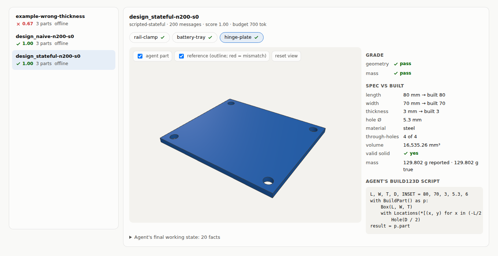
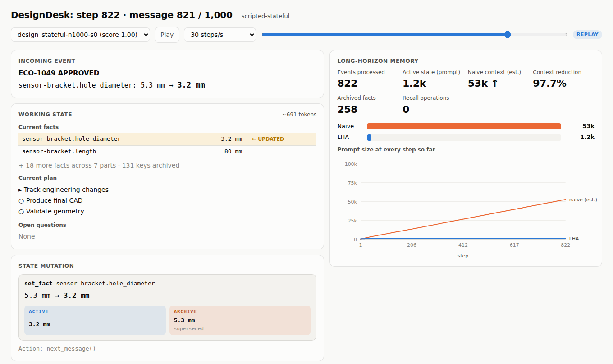
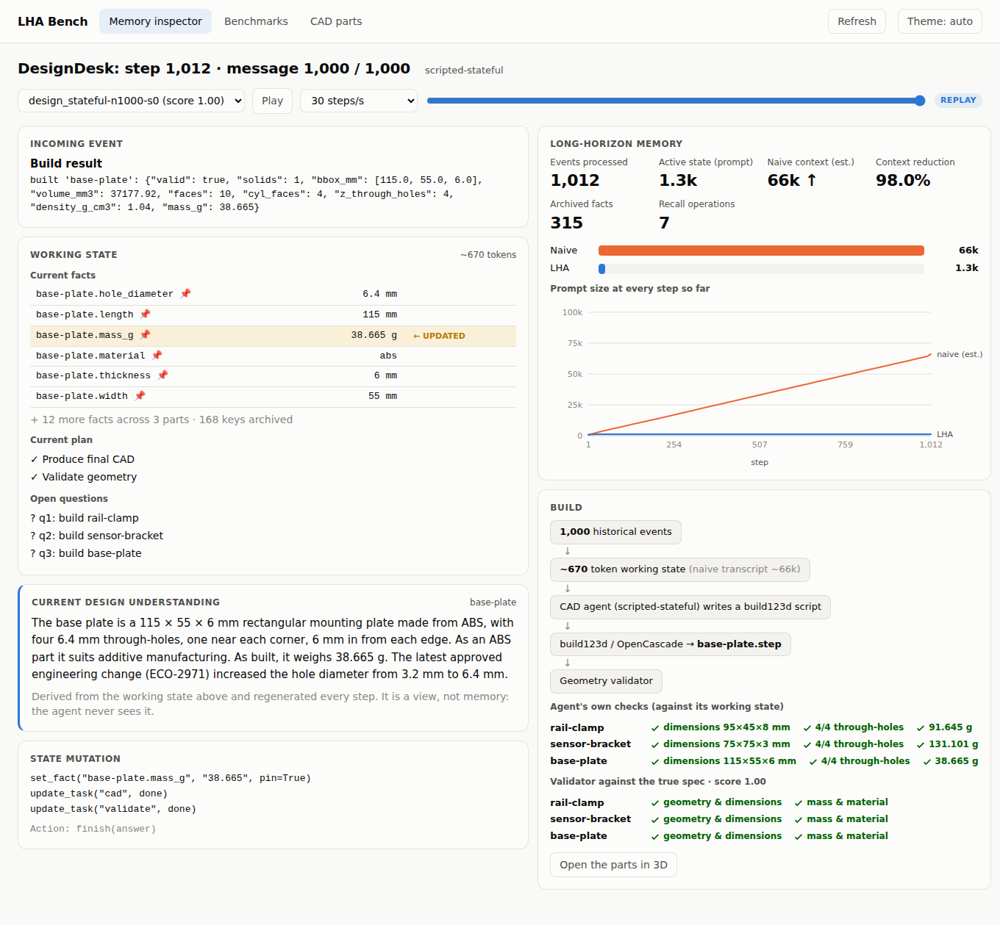
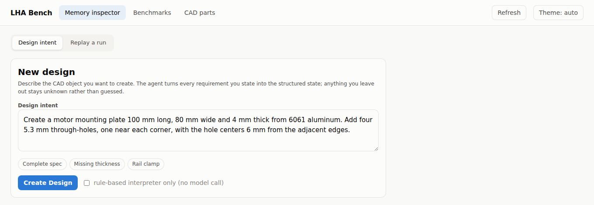
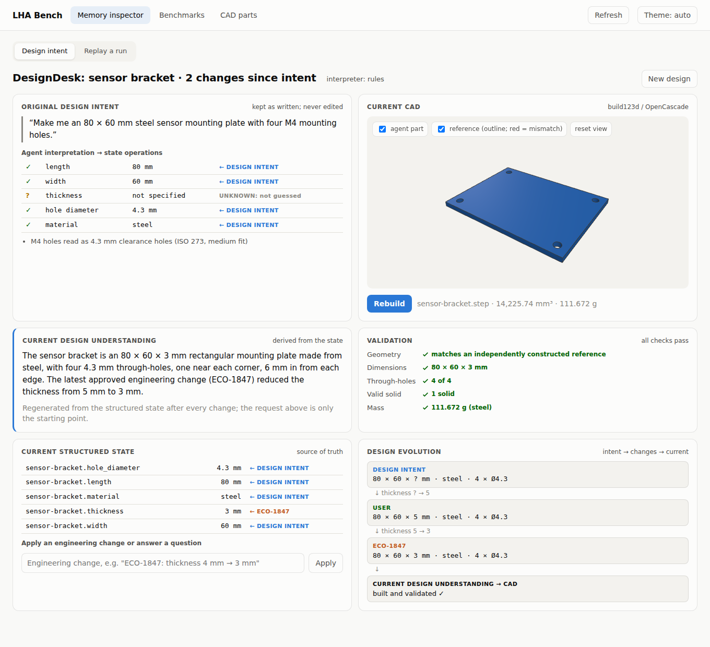
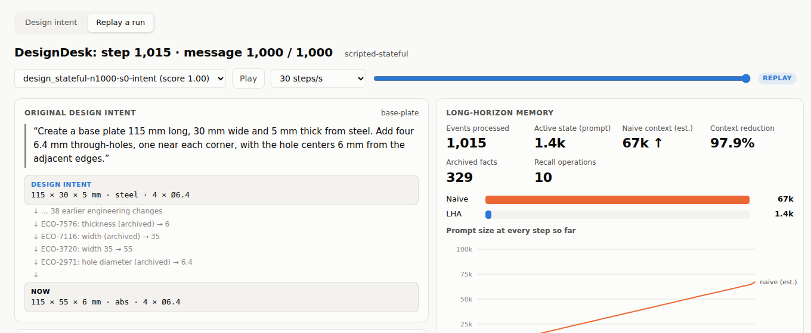
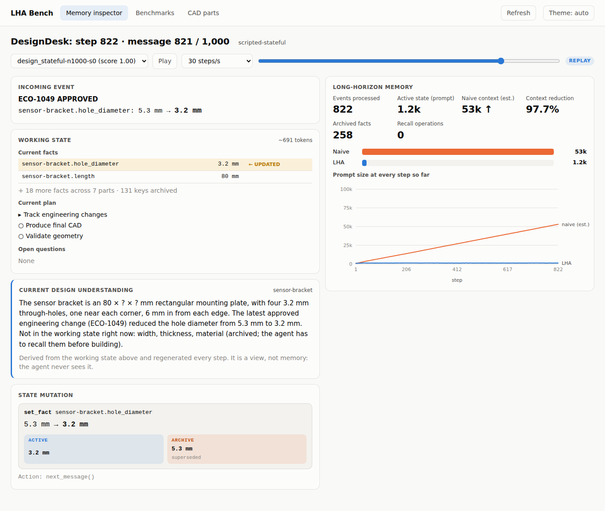
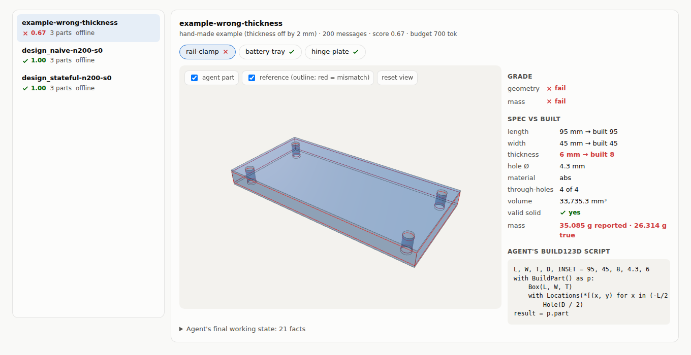
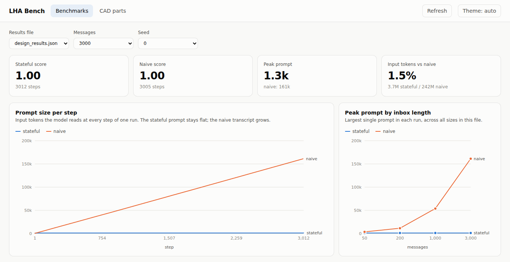

# LongHorizonAgent (LHA): state, not history

**History grows. State doesn't have to.**

**An agent architecture for runs that last thousands of steps, and a CAD agent built on it.** The
agent follows a mechanical design through thousands of engineering change orders, then writes
**build123d** (OpenCascade) scripts that produce real 3D parts. Each part is graded geometrically
against the true spec. A [Memory State Inspector](#watch-it-work-the-memory-state-inspector) shows, step
by step, how the agent keeps a ~1.3k-token working state while a naive transcript grows past 160k tokens.
A design can start from a plain-English request, and every step after that stays traceable:

**[Natural-Language Design Intent](#natural-language-design-intent-from-a-request-to-validated-cad) →
Structured State → [Current Design Understanding](#current-design-understanding-three-views-of-one-design) →
CAD Geometry**

The request is interpreted into ordinary state operations. The structured state is the source of truth;
the plain-English understanding and the validated 3D part are both derived from it.

```bash
pip install -e ".[dev,aws,cad]"
python -m lha.bench.run --env design --sizes 1000 --inspect   # watch it offline, no API key needed
python -m lha.ui                                              # dashboard: design intent, inspector, benchmarks, 3D parts
```



Most agents remember by appending: every tool result and every model reply goes back into the prompt.
That works for 20 steps. At 2,000 steps it breaks in three ways:

1. **Cost grows quadratically.** Step *n* re-reads everything from steps 1 to *n*-1. A 3,000-step run
   reads about 250 million input tokens.
2. **The context window runs out.** By step 3,000 the transcript is about 170k tokens.
3. **Stale and current facts sit side by side.** "The owner is alice" from step 12 and "the owner is
   dana" from step 1,840 are both in the prompt, and the model has to work out which one still holds.

**LHA drops the transcript.** Each step the model sees only a small, typed **working state**:
the goal, a plan, current facts with their sources, open questions and the last tool result. The model
edits that state with explicit operations (`set_fact`, `pin`, `drop_fact`, `add_task`, …). When the state
grows past a token budget, a compactor moves the least valuable items to an **archive**. The model can
search the archive with a `recall` tool whenever it needs something back.

The result is a prompt that stays about the same size at step 50 and at step 3,000, and total cost that
grows linearly instead of quadratically.

---

## Contents

- [Results at a glance](#results-at-a-glance)
- [Watch it work: the Memory State Inspector](#watch-it-work-the-memory-state-inspector)
- [Natural-Language Design Intent: from a request to validated CAD](#natural-language-design-intent-from-a-request-to-validated-cad)
- [Current Design Understanding: three views of one design](#current-design-understanding-three-views-of-one-design)
- [CAD modelling: what the agent builds](#cad-modelling-what-the-agent-builds)
- [How it works](#how-it-works)
- [The benchmarks](#the-benchmarks)
  - [IncidentDesk](#incidentdesk)
  - [DesignDesk (CAD)](#designdesk-cad)
- [The dashboard](#the-dashboard)
- [Installation](#installation)
- [Configuration and environment variables](#configuration-and-environment-variables)
- [Choosing a Bedrock model (and troubleshooting)](#choosing-a-bedrock-model-and-troubleshooting)
- [Running things](#running-things)
- [CAD tools reference](#cad-tools-reference)
- [Project layout](#project-layout)
- [Sponsor stack](#sponsor-stack)
- [Testing](#testing)
- [Limitations and roadmap](#limitations-and-roadmap)
- [3-minute demo script](#3-minute-demo-script)

---

## Results at a glance

Offline, where scripted policies read exactly the prompt a model would see, so token counts are exact:

| benchmark | messages | stateful peak prompt | naive peak prompt | stateful input tokens vs naive |
|---|---:|---:|---:|---:|
| IncidentDesk | 3,000 | **831** | 169,525 | **1.0%** |
| DesignDesk (CAD) | 3,000 | **1,335** | 161,302 | **1.5%** |

Live, with Claude Sonnet 4.5 on AWS Bedrock (DesignDesk, 50 messages, seed 0, two runs):

| run | agent | score | steps | peak prompt | total input tokens |
|---|---|---:|---:|---:|---:|
| 1 | **stateful** | **0.67** | 61 | 2,316 | 105,882 (44% of naive) |
| 1 | naive | 0.33 | 55 | 9,442 | 241,537 |
| 2 | stateful | 0.33 | 70 | 2,309 | 126,495 (53% of naive) |
| 2 | naive | 0.33 | 55 | 9,087 | 240,828 |

Both agents kept every spec value correctly. They lost points in CAD: the volumes show Sonnet cut the
holes only halfway through the plate (for example motor-mount at 56,871 mm³, where the correct part is
56,742.6 mm³ and a part with half-depth holes is 56,871.3 mm³). The stateful agent also rebuilt parts
it had already built. Both runs came before the fixes described under
[What the live runs taught us](#designdesk-cad), so they show where things stood, not what LHA can do.
At 50 messages the live budget also held every fact, so these runs didn't exercise eviction and recall.
Longer horizons (`--sizes 200,1000`) and more seeds are the next experiment. See
[Limitations](#limitations-and-roadmap).

---

## Watch it work: the Memory State Inspector

**History grows. State doesn't have to.** The inspector makes that visible while the agent runs. For
every step it shows the incoming event, the working state the model actually sees, the state mutation
the event caused (an overwrite forks into the ACTIVE value and the superseded value sent to the ARCHIVE;
evictions and recalls are shown too), and long-horizon memory counters: events processed, active prompt
against the naive context it replaces, context reduction, archived facts and recall operations.

A real frame, from step 822 of a 1,000-message DesignDesk run:

```text
DESIGNDESK — STEP 822 · MESSAGE 821 / 1,000                  scripted-stateful

INCOMING EVENT
──────────────────────────────────────────────────────────────────────────────
ECO-1049 APPROVED
sensor-bracket.hole_diameter: 5.3 mm → 3.2 mm

WORKING STATE                                                      ~691 tokens
──────────────────────────────────────────────────────────────────────────────
CURRENT FACTS
  sensor-bracket.hole_diameter              3.2 mm  ← UPDATED
  sensor-bracket.length                      80 mm
  + 18 more facts across 7 parts · 131 keys archived
CURRENT PLAN
  ▸ Track engineering changes
  ○ Produce final CAD
  ○ Validate geometry
OPEN QUESTIONS
  None

STATE MUTATION
──────────────────────────────────────────────────────────────────────────────
set_fact  sensor-bracket.hole_diameter
          5.3 mm → 3.2 mm
          ├─ ACTIVE   3.2 mm
          └─ ARCHIVE  5.3 mm  (superseded)
Action:  next_message()

LONG-HORIZON MEMORY
──────────────────────────────────────────────────────────────────────────────
Events processed                                 822
Active state (prompt)                   1,225 tokens
Naive context (est.)                 53,074 tokens ↑
Context reduction                              97.7%
Archived facts                                   258
Recall operations                                  0

Naive   ████████████████████████████████████████████████████████████ 53.1K
LHA     █ 1.2K
```

When the inbox runs out and the build requests arrive, a **BUILD** panel shows the path from thousands of
events to a checked part: historical events → ~1.3k-token working state → CAD agent → build123d →
`part.step` → the agent's own dimension and through-hole checks → the geometry validator's verdict
against the true spec.

```bash
python -m lha.bench.run --env design --sizes 1000 --inspect          # offline, animated at 30 steps/s
python -m lha.inspect design_stateful-n1000-s0 --speed 60              # replay any finished run
python -m lha.bench.run --env design --live --sizes 200 --skip-naive-above 200 --inspect   # live model
python -m lha.inspect live_design_stateful-n200-s0 --follow            # watch a live run from a 2nd terminal
```

The same view is the first tab of the dashboard (`python -m lha.ui`), with play/pause, a speed selector, a
step slider, a chart of prompt size at every step, and a button to open the built parts in 3D. It follows
live runs as they write their trace.





Every stateful run writes `runs/<run_id>/trace.jsonl` with one record per step, and both views read that
file. "Naive equivalent" is an estimate: the same goal plus every earlier reply and tool result
replayed as a transcript, measured with the same ~4 characters per token as everything else. The real
naive agent, run separately, lands in the same range: 53.9k tokens at 1,000 messages against the
estimate's 53k near the end of the inbox.

---

## Natural-Language Design Intent: from a request to validated CAD

This is the entry point of the architecture: human intent → structured state. A user describes a part
in plain English. The agent interprets the request into the same state operations it uses everywhere
else, and the existing pipeline takes over from there:

**Natural-Language Intent → Structured State → Current Design Understanding → CAD Geometry**



**Interpretation is explicit and conservative** (`lha/intent.py`):

- Every requirement the request states becomes a `set_fact` with `source = design_intent`.
- Every requirement it leaves open becomes an open question (`add_question`) and stays **unknown**. It is
  never guessed, and the part can't be built until it is answered.
- Conventions the interpreter does apply are shown as notes (for example, an M4 hole read as a 4.3 mm
  clearance hole), as are requests this part family can't honour (six holes, another hole inset).
- Two interpreters share one output schema. A deterministic rule-based one works offline. A model-based
  one runs when a Bedrock (or OpenAI-compatible) model is configured, and its output is validated against
  the same schema, falling back to the rules if the call fails.

| request | interpretation |
|---|---|
| "Create a motor mounting plate 100 mm long, 80 mm wide and 4 mm thick from 6061 aluminum. Add four 5.3 mm through-holes, one near each corner, with the hole centers 6 mm from the adjacent edges." | length 100, width 80, thickness 4, hole Ø 5.3, al6061, all ← DESIGN INTENT |
| "Make me an 80 × 60 mm steel sensor mounting plate with four M4 mounting holes." | length 80, width 60, hole Ø 4.3 (note: M4 clearance), steel; **thickness UNKNOWN** |
| "Create a 95 × 45 × 6 mm rail clamp from ABS with four 4.3 mm mounting holes." | length 95, width 45, thickness 6, hole Ø 4.3, abs |

**Provenance stays visible.** Every fact shows where its current value came from: ← DESIGN INTENT,
← ECO-1847, ← USER (an answer), or ← ECO-7576 · recalled after a trip through the archive. The request is
kept as the *original* design intent, and it is never a second source of truth. Engineering changes
overwrite facts with `set_fact` as usual, and the old value goes to the archive.

In the dashboard's **Design intent** view (the first thing the Memory inspector shows), a design reads as:

| | |
|---|---|
| **Original design intent**: the request as written, and the agent's interpretation (✓ per stated value, ? per unknown) | **Current CAD**: the part in 3D over an independently built reference, with `.step` export |
| **Current design understanding**: regenerated from the state after every change | **Validation**: geometry, dimensions, through-holes, valid solid, mass |
| **Current structured state**: facts with provenance, open questions, and a box to apply a change or answer a question | **Design evolution**: intent → each change → current, with the CAD marked stale until rebuilt |



Each design is saved under `results/runs/intent_<part>-<time>/`: the original intent, the working state,
the archive, a log of every operation, and the CAD files. It also appears in the CAD parts tab.

**Over a long horizon.** `python -m lha.bench.run --env design --intent` starts one requested part from a
design request instead of seeding ECOs. The agent (scripted or live) loads the request into its state at
step 1, then hundreds of ECOs change that part while it is evicted and recalled. The inspector's
**Original design intent** card traces intent → each ECO → the current spec that gets built:



---

## Current Design Understanding: three views of one design

Every part exists in three synchronized forms, and all three show the current design after any number of
engineering changes:

| view | what it is | role |
|---|---|---|
| **Structured state** | the facts in the working state, e.g. `motor-mount.thickness = 4` | source of truth |
| **Current Design Understanding** | a plain-English paragraph generated from those facts | human-readable view |
| **CAD geometry** | the build123d part, `.brep` and `.step` | physical realization |

The description is a pure function of the working state (`lha/describe.py`). It is regenerated whenever
the state changes, is never stored, and is never shown to the agent, so it can't become a second, drifting
copy of the facts. No model call is involved. It covers the part's shape and dimensions, material, hole
features, its built mass once there is one, and the latest approved engineering change to it. If a value
isn't in the working state at that moment, for example because it was evicted, it says so rather than
guessing:

> The sensor bracket is an 80 × ? × ? mm rectangular mounting plate, with four 3.2 mm through-holes, one
> near each corner, 6 mm in from each edge. The latest approved engineering change (ECO-1049) reduced the
> hole diameter from 5.3 mm to 3.2 mm. Not in the working state right now: width, thickness, material
> (archived; the agent has to recall them before building).

After the build, the same generator describes the finished part:

> The rail clamp is a 95 × 45 × 8 mm rectangular mounting plate made from 6061 aluminum, with four 3.2 mm
> through-holes, one near each corner, 6 mm in from each edge. As built, it weighs 91.645 g. The latest
> approved engineering change (ECO-6713) increased the length from 80 mm to 95 mm.

It appears as a **CURRENT DESIGN UNDERSTANDING** panel in the terminal inspector, as a card next to the
working state in the dashboard's Memory inspector tab (following the part the agent is working on, step by
step), and above each part in the CAD parts tab. In the CAD parts tab it is built from the agent's final
working state, so reading it next to the grade shows whether the agent's understanding matched the true spec.



---

## CAD modelling: what the agent builds

The agent works on CAD **as code**. It never drives a GUI. It writes a short
[build123d](https://github.com/gumyr/build123d) script, the `cad_build` tool runs the script in the
OpenCascade geometry kernel (the same kernel FreeCAD uses), and the agent gets back measurements it can
check. This runs headless, so it works in a container or CI, on any OS, with no CAD licence.

```text
 inbox message                working state                 agent's script                build123d / OpenCascade
 ─────────────                ─────────────                 ──────────────                ───────────────────────
 [ECO-7871] hinge-plate:  ─►  hinge-plate.thickness = 3 ─►  L, W, T, D = 80, 70, 3, 5.3 ─►  solid B-rep part
 thickness changed to 3 mm    hinge-plate.width = 70         Box(L, W, T)                   │
                              hinge-plate.material = steel   Hole(D/2) at 4 corners         ▼
                              ... (recalled if evicted)      result = p.part             measurements back to the agent:
                                                                                         valid, bbox_mm, volume_mm3,
                                                                                         z_through_holes, mass_g
                                                                                            │
                                                                                            ▼
                                                           grader: same shape as the reference part? mass within 1%?
```

**1. What a part is.** DesignDesk uses eight mounting plates (`base-plate`, `motor-mount`, `lid`, …).
Each is a rectangular plate `length × width × thickness` with four corner through-holes 6 mm in from
each edge, made of one of five materials. The shapes are deliberately simple, so a model can build
them reliably and the grading is exact. The hard part is getting every number current after thousands
of changes.

**2. What the agent writes.** A real script from a run (`results/runs/<run>/cad/hinge-plate.py`):

```python
L, W, T, D, INSET = 80, 70, 3, 5.3, 6
with BuildPart() as p:
    Box(L, W, T)
    with Locations(*[(x, y) for x in (-L/2 + INSET, L/2 - INSET) for y in (-W/2 + INSET, W/2 - INSET)]):
        Hole(D / 2)
result = p.part
```

**3. What the agent gets back.** One line of numbers, never the geometry itself, so the prompt stays small:

```text
built 'hinge-plate': {"valid": true, "solids": 1, "bbox_mm": [80.0, 70.0, 3.0], "volume_mm3": 16535.26,
                      "faces": 10, "cyl_faces": 4, "z_through_holes": 4, "density_g_cm3": 7.85, "mass_g": 129.802}
```

The agent is told to compare `bbox_mm` and `z_through_holes` with the spec, fix the script and rebuild
if they differ, and record `<part>.mass_g` once the part is right. If a script raises an error, the error
comes back as the observation so the model can fix it.

**4. How it is graded.** The grader builds the reference part from the true final spec and compares it
with what the agent built. Bounding boxes must match to 0.01 mm, and the volume in one solid but not
the other must be under 0.1% of the part after aligning centres. The reported mass must be within 1%.
A stale thickness, a wrong hole size, a hole in the wrong place or a hole that stops halfway all fail.

**5. How to see it.** `python -m lha.ui` shows every part in 3D over its reference. A wrong part turns
see-through and the reference outline turns red. Here the part was built 8 mm thick instead of 6 mm (a
hand-made example; see [the dashboard](#the-dashboard)):



The Current Design Understanding above the grade still reads "95 × 45 × 6 mm". The working state had the
right thickness, so the mistake was in the build step, not in memory. Putting the three views side by side
is what lets you tell those two kinds of failure apart.

**6. Where the files go.** For each run, `results/runs/<run_id>/cad/` holds each part's script (`.py`)
and exact shape (`.brep`). `cad_export` writes STEP (for FreeCAD, Fusion 360, SolidWorks, Onshape) or STL
(for slicers and 3D printing).

**7. Using it outside the benchmark.** The CAD tools are ordinary tools, so any LHA agent can use them.
With `--cad`, your own goal gets them:

```bash
python -m lha.cli run "Design a 60x40 mm Raspberry Pi camera mount plate, 3 mm PLA, M2.5 holes on a 21x12.5 mm pattern, export STEP" --run-id cam1 --cad
ls runs/cam1/cad/        # the script, the .brep and the exported .step
```

Full tool reference: [CAD tools reference](#cad-tools-reference). Benchmark details:
[DesignDesk](#designdesk-cad).

---

## How it works

```
               +----------------------------- every step -----------------------------+
               |                                                                      |
  WorkingState |  render() ─► LLM (Bedrock) ─► {state_ops, action} ─► apply_ops ─► tool |
  (bounded,    |      ▲                                                  │         │   |
   checkpointed|      └──────── Compactor keeps it under budget ◄────────┘         │   |
   each step)  |                (cheap model, e.g. Liquid LFM, digests evictions)  │   |
               +───────────────────────────────────────────────────────────────────┼───+
                                                                                   ▼
                     Archive (append-only JSONL, searchable) ──► Tinybird (live analytics)
                     superseded facts · evicted facts · every observation · notes
```

### One step

1. **Render.** `WorkingState.render()` turns the state into the prompt. It is the model's only view
   of the past (`lha/state.py`).
2. **Decide.** The model replies with one JSON object:
   ```json
   {"thought": "ECO changes base-plate thickness; record it and keep reading.",
    "state_ops": [{"op": "set_fact", "key": "base-plate.thickness", "value": "5", "source": "ECO-7634"}],
    "action": {"tool": "next_message", "args": {}}}
   ```
3. **Apply.** `apply_ops` edits the state. `set_fact` overwrites, and the old value goes to the
   archive as a `superseded_fact`, so a stale belief never sits next to the current one.
4. **Act.** The tool runs. Its full result is archived, and the state keeps only this latest
   observation (truncated to 1,200 characters).
5. **Compact.** If the rendered state is over budget, the `Compactor` evicts items in order from
   cheapest to most valuable to lose: notes → observation text → closed tasks → unpinned facts,
   least recently used first. Pinned facts are never evicted. Evicted keys stay listed as breadcrumbs
   under `# ARCHIVED`, so the model knows what it can recall.
6. **Checkpoint.** The state is written atomically to `runs/<run_id>/state.json` (write to a temp
   file, then `os.replace`).

### What the model actually sees

This is a real rendered state from a DesignDesk run at step 150 of 200. It is the whole prompt apart
from the fixed system prompt:

```text
# GOAL
You are the CAD engineer for a set of mounting plates. Drain the engineering inbox ... (abridged)

# STEP 150

# FACTS (current beliefs; superseded values are archived)
- base-plate.hole_diameter = "6.4" (src: eco, step 93)
- base-plate.material = "pla" (src: eco, step 62)
- battery-tray.material = "al6061" (src: eco, step 125)
- gusset.width = "45" (src: eco, step 137)
- rail-clamp.thickness = "6" (src: eco, step 81)
  ... 27 facts in total

# ARCHIVED (use the recall tool to fetch)
motor-mount.thickness, motor-mount.hole_diameter, motor-mount.material, sensor-bracket.length,
sensor-bracket.width, ... (+7 more)

# LAST OBSERVATION
next_message({}) ->
msg 150/200: [ECO-8219] sensor-bracket: hole_diameter changed to 4.3 mm (approved by lena)
```

### State sections

| Section | Lifetime | How it leaves the prompt |
|---|---|---|
| `goal` | whole run | never |
| `facts` (key → value, source, step, confidence, pinned) | until overwritten or dropped | `set_fact` **overwrites** and archives the old value. Unpinned, least-recently-used facts are evicted when over budget. |
| `tasks` (the plan) | until closed | done and dropped tasks are collapsed into a one-line digest |
| `questions` | until resolved | `resolve_question` |
| `focus` | one line | overwritten |
| `notes` | volatile | bounded ring buffer (8); the oldest roll off first |
| `observation` | **one step** | only the latest tool result is shown; every result is archived |

### State edit operations

| op | effect |
|---|---|
| `{"op":"set_fact","key":K,"value":V,"source":S,"pin":bool}` | create or overwrite a belief; the old value is archived |
| `{"op":"drop_fact","key":K,"reason":R}` | remove a belief (archived, breadcrumb kept) |
| `{"op":"pin","key":K}` / `{"op":"unpin","key":K}` | pinned facts are never evicted |
| `{"op":"add_task","id":ID,"title":T}` / `{"op":"update_task","id":ID,"status":…,"result":R}` | the plan; statuses are `todo`, `doing`, `done`, `blocked`, `dropped` |
| `{"op":"add_question","text":Q}` / `{"op":"resolve_question","text":Q,"answer":A}` | open unknowns |
| `{"op":"note","text":T}` / `{"op":"clear_notes"}` | volatile scratch |
| `{"op":"set_focus","text":T}` | one line: what the agent is doing now |

### Archive and recall

`lha/archive.py` is an append-only JSONL log (`runs/<run_id>/archive.jsonl`) holding superseded,
evicted and dropped facts, every tool observation, notes, resolved questions and closed tasks.
`recall` is a BM25-style lexical search over it with a few details that matter for real models:

- **Keys match however the model spelled them.** `base-plate_width`, `base-plate.width` and
  `base-plate width` all find each other, because compound tokens are also indexed by their parts.
  An exact key match always ranks first.
- **Recall never returns its own past results.** Otherwise a model searching for something it can't
  find keeps matching its own earlier queries and loops.
- **Facts come back as one short line each**, e.g. `[step 35] evicted_fact motor-mount.width = "75" (src: ECO-5104)`.

### Robustness for long runs

- **Crash-safe and resumable.** Kill the process at any point, run again with the same `--run-id`
  (hours or days later) and it continues from the exact step.
- **Mistakes never crash a run.** Malformed JSON, unknown ops and tool exceptions come back to the
  model on the next step under `# FEEDBACK FROM LAST STEP` or as an `ERROR in <tool>` observation.
- **Bedrock calls can't hang silently.** Each call has a 60 s read timeout (`LHA_LLM_TIMEOUT`) and one
  retry, then fails with a clear error.

### The baseline

`NaiveAgent` (`lha/agent.py`) shares everything except memory: its prompt is the goal plus the whole
transcript of earlier replies and tool results. It is the standard way agents are built, and the
thing LHA is compared against.

---

## The benchmarks

Both benchmarks share one idea: **the ground truth drifts**. Values change many times during the run,
so information goes stale, and the final questions deliberately target values that changed most *and*
values last seen near the very start.

Each benchmark can run two ways:

- **Offline (default).** A scripted Python policy stands in for the model. It receives exactly the
  prompt a model would receive and replies in the same JSON format. Runs are free, deterministic and
  take seconds, and token counts are exact. This tests the machinery (eviction, recall, CAD building,
  grading) and measures cost, but both scripted agents read perfectly, so their accuracy ties at 1.00.
- **Live (`--live`).** A real model on Bedrock makes every decision. This is where accuracy differences
  show up.

### IncidentDesk

`lha/bench/incident_desk.py`. The agent drains an inbox of N messages about 12 services. About 30% are
updates that change a service's owner, region or version:

```text
[pager] ownership transfer: payments-api is now owned by dana (ticket OPS-4821)
[infra] geo primary region migrated to eu-west-1; old region drained (change CHG-1177)
[deploy] ledger rolled out v3.4 to 100% of traffic (build #9912)
```

The rest is log noise, chat and CI chatter. When the inbox is empty, the agent is asked for the
*current* value of 6 attributes and answers with `finish`. Score = fraction answered correctly.

`python -m lha.bench.run` (working-state budget 450 tokens):

| messages | agent | score | steps | peak prompt tok | total input tok | cost vs naive |
|---:|---|---:|---:|---:|---:|---:|
| 50 | **stateful** | 1.00 | 54 | 831 | 40,005 | **51.3%** |
| 50 | naive | 1.00 | 52 | 2,878 | 78,000 | 100% |
| 200 | **stateful** | 1.00 | 206 | 876 | 164,966 | **14.5%** |
| 200 | naive | 1.00 | 202 | 11,224 | 1,136,749 | 100% |
| 1,000 | **stateful** | 1.00 | 1,003 | 831 | 821,481 | **2.9%** |
| 1,000 | naive | 1.00 | 1,002 | 56,087 | 28,079,688 | 100% |
| 3,000 | **stateful** | 1.00 | 3,005 | 831 | 2,465,035 | **1.0%** |
| 3,000 | naive | 1.00 | 3,002 | 169,525 | 253,700,413 | 100% |

### DesignDesk (CAD)

`lha/bench/design_desk.py`. The same idea, except the agent has to produce a CAD part, not just an answer.

**The parts.** Eight mounting plates: `base-plate`, `motor-mount`, `sensor-bracket`, `battery-tray`,
`lid`, `gusset`, `rail-clamp`, `hinge-plate`. Each is a rectangular plate `length × width × thickness`
(mm), centred on the origin, with 4 through-holes whose centres sit 6 mm in from both edges at each
corner. Each part has 5 properties:

| property | values |
|---|---|
| length | 50 – 120 mm (steps of 5) |
| width | 30 – 80 mm (steps of 5) |
| thickness | 2, 3, 4, 5, 6, 8 mm |
| hole_diameter | 3.2, 4.3, 5.3, 6.4 mm (M3–M6 clearance) |
| material | al6061, steel, ti6al4v, abs, pla |

**The inbox.** The first 40 messages set every property of every part. After that, about 30% are
engineering change orders (ECOs) that overwrite a value, and the rest are distractors. Some distractors
look like changes but aren't:

```text
[ECO-7634] base-plate: thickness changed to 5 mm (approved by yuki)            <- counts
[proposal] base-plate: thickness 79 mm suggested by lena -- REJECTED at design review, no change
[proposal] sensor-bracket: switch to abs? yuki to get quotes; not approved, keep current material
[supplier] quote for 200x gusset: $4.52 each, lead time 2 weeks
[cam] toolpath for motor-mount regenerated in 30s; 2 warnings (all cosmetic)
```

**The ending.** When the inbox is empty the agent gets three build requests (the most-changed parts,
plus the part whose spec went quiet earliest):

```text
INBOX EMPTY. Build requests -> q1: build motor-mount; q2: build base-plate; q3: build battery-tray
```

For each part the agent works out the current spec (recalling anything evicted), writes a
**build123d** script, builds it with `cad_build`, and finishes with the mass reported by the build:

```json
{"answer": {"q1": {"part": "motor-mount", "mass_g": 251.94}, "q2": {...}, "q3": {...}}}
```

**Grading is geometric**, so a model can't talk its way to a pass:

- **Geometry:** the built solid must match a reference solid built from the true spec. Both bounding
  boxes must agree to 0.01 mm, and after aligning the two parts' centres, the symmetric difference
  (the volume in one part but not the other) must be under 0.1% of the part's volume. One stale value
  fails it: a thickness, a hole size, or a hole in the wrong place.
- **Mass:** the reported mass must be within 1% of the true mass (volume × material density), which
  also checks the material.

Each part scores the average of the two checks, and the run scores the average over the three parts.

`python -m lha.bench.run --env design` (budget 700 tokens offline, 1,100 with `--live`):

| messages | agent | score | steps | peak prompt tok | total input tok | cost vs naive |
|---:|---|---:|---:|---:|---:|---:|
| 50 | **stateful** | 1.00 | 58 | 1,340 | 66,655 | **64.4%** |
| 50 | naive | 1.00 | 55 | 3,530 | 103,540 | 100% |
| 200 | **stateful** | 1.00 | 209 | 1,359 | 251,212 | **21.1%** |
| 200 | naive | 1.00 | 205 | 11,484 | 1,190,696 | 100% |
| 1,000 | **stateful** | 1.00 | 1,012 | 1,331 | 1,231,307 | **4.5%** |
| 1,000 | naive | 1.00 | 1,005 | 53,897 | 27,159,643 | 100% |
| 3,000 | **stateful** | 1.00 | 3,014 | 1,335 | 3,673,738 | **1.5%** |
| 3,000 | naive | 1.00 | 3,005 | 161,302 | 241,781,104 | 100% |

The stateful agent takes a few extra steps at larger sizes: those are `recall` calls fetching evicted specs. The
scripted agent also keeps a three-item plan (track changes → produce CAD → validate), as a real model is
expected to, which is what the inspector's CURRENT PLAN shows.

**What the live runs taught us.** The first live Sonnet run scored **0.00** for the stateful agent. The
model keyed facts as `base-plate_width`, the tokenizer treated that as one word, every recall missed,
and the agent then kept matching its own past queries until it ran out of steps. That led to the
recall fixes described [above](#archive-and-recall), a key-naming hint in the goal text and a larger
live budget. After those fixes the same setup scored 0.67 (stateful) against 0.33 (naive).

The next runs scored 0.33 for both agents. Every spec value was right, but Sonnet's scripts cut the holes
only halfway through. `cad_build` counted the cylindrical faces, which looked fine, so the model had no way
to notice. It now also reports `z_through_holes`, and the task text asks the agent to check `bbox_mm` and
`z_through_holes` against the spec, to fix and rebuild if they don't match, and to record
`<part>.mass_g` once a part is right so it doesn't rebuild it. Both agents get the same instructions.

---

## The dashboard



```bash
python -m lha.ui                         # opens http://127.0.0.1:8765 and reads ./results
python -m lha.ui --results other/dir --port 9000 --no-browser
```

A local web page (stdlib HTTP server, bound to localhost, no extra installs). It has three tabs.

**Memory inspector** (opens first), in two modes:
- **Design intent** (the default): describe a part in plain English, see how it was interpreted, then build,
  validate and change it. See [Natural-Language Design Intent](#natural-language-design-intent-from-a-request-to-validated-cad).
- **Replay a run**: pick any traced run: offline, live, or still running (marked LIVE, and it follows the run as it goes).
- Play/pause, a speed selector and a step slider move through the run one step at a time.
- Each step shows the incoming event, the working state (facts for the part in focus marked ← UPDATED or
  ← RECALLED, the plan, open questions), the state mutation (an overwrite drawn as its ACTIVE and ARCHIVE
  halves; evictions and restores listed), and long-horizon memory: events, active prompt, naive context
  (with ↑ while it grows), context reduction, archived facts, recall operations, the two bars, and a chart
  of prompt size at every step so far.
- A **Current Design Understanding** card beside the working state: the part in focus described in plain
  English, regenerated from the facts at every step (dimensions, material, holes, latest ECO, and any
  values currently archived).
- In the build phase: the pipeline from historical events to working state, build123d, `.step` file and
  validator, with the agent's own checks per part and the final verdict, plus a button to open the parts in 3D.
- See [Watch it work](#watch-it-work-the-memory-state-inspector) for the terminal version and what each part means.

**Benchmarks**
- Pick any results file (offline `results.json` / `design_results.json`, or live `live_*`), a message count
  and a seed.
- Stat tiles: both scores, peak prompt, and stateful input tokens as a percentage of naive.
- **Prompt size per step:** one line per agent, flat for stateful and rising for naive, with hover values.
- **Peak prompt by inbox length:** how each agent's largest prompt scales with N.
- A table of every run. Clicking a DesignDesk row opens its parts.

**CAD parts**
- Every DesignDesk run, with its score.
- A 3D view (three.js; drag to rotate, scroll to zoom) of each part the agent built, with the
  **reference part drawn as an outline over it**. If the part is wrong, the agent's part turns
  see-through and the outline turns red, so you see exactly where the shapes differ.
- Beside it: the **Current Design Understanding** of the part from the agent's final working state, pass/fail
  for geometry and mass, each spec value next to what was actually built (mismatches in red), hole count,
  volume, reported against true mass, the **build123d script the agent wrote**, and the agent's final
  working state.

Runs save what the dashboard needs: `runs/<run_id>/trace.jsonl` (one inspector record per step),
`summary.json` (answer, per-part grades, specs) and every built part as an exact `.brep` and a `.step`
next to its `.py` script. Click **Refresh** to pick up new runs.
three.js loads from jsDelivr, so the browser needs internet access.

---

## Installation

Requires Python 3.10+.

```bash
git clone https://github.com/somul18/LongHorizonAgent_v1.git
cd LongHorizonAgent_v1
pip install -e ".[dev,aws,cad]"
pytest -q
```

| extra | installs | needed for |
|---|---|---|
| (none) | nothing: the core is pure standard library | the architecture, IncidentDesk offline |
| `dev` | pytest | tests |
| `aws` | boto3, `anthropic[bedrock]` | live runs on Bedrock |
| `cad` | build123d (OpenCascade) | CAD tools, DesignDesk, the dashboard's 3D view |

If pip warns that `aiobotocore requires botocore<…`, that comes from another package in your environment
(often s3fs). LHA does not use it. Use a fresh virtualenv (`python -m venv .venv && source .venv/bin/activate`)
if you need both.

### Updating an existing clone

```bash
git switch main
git pull
pip install -e ".[dev,aws,cad]"     # only needed when dependencies change; harmless otherwise
pytest -q
```

Your `.env` and anything under `results/runs/` or `results/live_*` are git-ignored, so pulling never touches them.

---

## Configuration and environment variables

Copy the template and fill it in:

```bash
cp .env.example .env
$EDITOR .env
```

That's all. `lha.cli`, `lha.bench.run` and `lha.ui` load `.env` automatically at startup: first
`./.env` in the folder you run from, then the `.env` at the repository root. So a new terminal needs no
`export` or `source`. Variables already set in your terminal take priority over the file, and empty values
in it are ignored. `.env` is git-ignored.

To use the same settings in other tools (the AWS CLI, your own scripts), load it into the terminal yourself:
`set -a; source .env; set +a`.

| variable | required for | meaning |
|---|---|---|
| `LHA_BEDROCK_MODEL_ID` | live runs | Bedrock model. Versioned IDs (`us.anthropic.claude-sonnet-4-5-20250929-v1:0`) use the Converse API; short IDs (`anthropic.claude-sonnet-5`) use Bedrock's Messages API. Chosen automatically from the ID. |
| `AWS_REGION` | live runs | e.g. `us-east-1` |
| AWS credentials | live runs | `~/.aws/credentials` (via `aws configure`), `AWS_PROFILE`, or `AWS_ACCESS_KEY_ID` + `AWS_SECRET_ACCESS_KEY` (+ `AWS_SESSION_TOKEN` for temporary keys) |
| `LHA_LLM_TIMEOUT` | optional | seconds before a Bedrock call is abandoned (default 60, one retry) |
| `LHA_EFFORT` | optional | `low` … `max`: thinking depth per step, short-ID models only |
| `LHA_LIQUID_BASE_URL`, `LHA_LIQUID_MODEL`, `LHA_LIQUID_API_KEY` | optional | Liquid AI LFM (or any OpenAI-compatible endpoint) that writes compaction digests; if no Bedrock model is set, it also runs the agent |
| `NIMBLE_CREDENTIALS`, `LHA_NIMBLE_BASE_URL` | optional | Nimble `web_search` / `web_fetch` tools for `lha.cli run` |
| `TINYBIRD_TOKEN`, `TINYBIRD_HOST` | optional | stream every step and archive item to Tinybird |
| `LHA_RUNS_DIR` | optional | where `lha.cli` keeps runs (default `./runs`) |

Offline benchmarks and the dashboard need none of these.

---

## Choosing a Bedrock model (and troubleshooting)

Which Claude models an AWS account can call varies by account and region. Check before running anything:

```bash
python -m lha.cli models                   # probes us-east-1 (or $AWS_REGION)
python -m lha.cli models --region us-west-2
```

It sends a tiny request to nine Claude models, from the newest (Opus 5.5, Sonnet 5) down to Sonnet 4.5
and Haiku 4.5, and costs well under a cent. Each line shows `OK` or the reason it failed. At the end it
prints `export` lines for the best model that worked.

| error | meaning | fix |
|---|---|---|
| `NoCredentialsError: Unable to locate credentials` | no AWS keys found | put them in `.env` (loaded automatically) or run `aws configure` |
| `UnrecognizedClientException: security token … invalid` / `ExpiredToken` | keys wrong or expired | get fresh keys (temporary keys expire) |
| `Model use case details have not been submitted` | the account never filled Anthropic's one-time form | AWS console → Bedrock → Model catalog → any Anthropic model → **Submit use case details**; wait a few minutes |
| `This Model is marked by provider as Legacy …` | the model is retired for accounts that haven't used it recently | pick a newer model from `lha.cli models` |
| `… is not available for this account` (403) | that model isn't enabled for the account | use a model that shows `OK`, or ask AWS / your organiser for access |
| `on-demand throughput isn't supported … inference profile` | a versioned ID without a region prefix | prefix it: `us.anthropic.claude-…-v1:0` |
| a run prints nothing for minutes | a slow call (before per-step output existed) | pull the latest code: every step now prints, and calls time out after 60 s |

Budget note: live runs cost real money. DesignDesk at 50 messages with both agents reads about 350k
input tokens with Sonnet 4.5. The naive agent's cost grows quadratically, so use `--skip-naive-above`.

---

## Running things

### Benchmark runner: `python -m lha.bench.run`

Runs both agents on the same task for every combination of size and seed, prints a line per run (and per
step with `--live`), then a table.

| flag | default | meaning |
|---|---|---|
| `--env incident\|design` | `incident` | which benchmark |
| `--sizes 50,200` | `50,200,1000,3000` | inbox lengths |
| `--seeds 0,1,2` | `0` | different random inboxes |
| `--live` | off | use the model from `LHA_BEDROCK_MODEL_ID` instead of the scripted policies |
| `--budget N` | 450 incident, 700 design, +400 with `--live` | stateful working-state budget (tokens) |
| `--skip-naive-above N` | never | skip the naive agent above N messages |
| `--out DIR` | `results` | output directory |
| `--intent` | off | DesignDesk: one requested part starts from a natural-language design request instead of ECOs |
| `--inspect` | off | show the Memory State Inspector while the stateful agent runs |
| `--inspect-speed N` | 30 offline, unthrottled live | steps per second for `--inspect` |

Outputs:

| file | contents |
|---|---|
| `results/report.md`, `results/results.json` | IncidentDesk offline table and rows (with per-step prompt curves) |
| `results/design_report.md`, `results/design_results.json` | DesignDesk offline |
| `results/live_*` | the same for live runs (git-ignored, so they never block `git pull`) |
| `results/steps.jsonl` | one line per step for every run |
| `results/runs/<run_id>/` | `state.json`, `archive.jsonl`, `trace.jsonl` (one inspector record per step), `summary.json`, and `cad/<part>.py` + `.brep` + `.step` |

Run ids look like `design_stateful-n200-s0`. Live runs are prefixed `live_`.

Examples:

```bash
python -m lha.bench.run --env design                                   # offline, all sizes, ~10 s
python -m lha.bench.run --env design --live --sizes 50 --skip-naive-above 200
python -m lha.bench.run --env design --live --sizes 200,1000 --seeds 0,1,2 --skip-naive-above 200
```

### Your own agent: `python -m lha.cli`

```bash
python -m lha.cli run "Track this week's major open-weight model releases: name, org, params, license" --run-id rel1
python -m lha.cli run --run-id rel1          # resume after Ctrl-C, a crash, or tomorrow
python -m lha.cli state rel1                 # print the working state: everything the agent believes
python -m lha.cli recall rel1 "license"      # search its archive
python -m lha.cli run "Design a 60x40 mm Raspberry Pi camera mount, 3 mm PLA, export STEP" --run-id cad1 --cad
python -m lha.cli models                     # which Bedrock models this account can call
```

| `run` flag | default | meaning |
|---|---|---|
| `--run-id` | required | names the run; reuse it to resume |
| `--budget` | 2000 | working-state budget in tokens |
| `--max-steps` | 100 | stop after this many steps (resume to continue) |
| `--cad` | off | add the build123d CAD tools; parts go to `runs/<run_id>/cad/` |

Web tools are added automatically when `NIMBLE_CREDENTIALS` is set.

### Using LHA from Python

```python
from lha.agent import StatefulAgent
from lha.cad import cad_tools
from lha.compactor import Compactor
from lha.llm import from_env
from lha.tools import Tool, ToolBox

def lookup(args: dict) -> str:                  # any function returning a string is a tool
    return f"price of {args['sku']}: $4.20"

tools = ToolBox([Tool("lookup", 'price lookup. args: {"sku": str}', lookup), *cad_tools("runs/demo/cad")])
agent = StatefulAgent(from_env(), tools, goal="Quote and model a 60x40x3 PLA bracket", run_dir="runs",
                      run_id="demo", compactor=Compactor(budget_tokens=1500), max_steps=50, verbose=True)
print(agent.run())                              # the answer passed to finish
```

---

## CAD tools reference

`lha/cad.py` wraps [build123d](https://github.com/gumyr/build123d) (the OpenCascade kernel, headless, no GUI)
as ordinary LHA tools. The agent writes a short Python script; `from build123d import *` is already
imported, and the script assigns the finished solid to `result`. Units are millimetres.

```python
# e.g. what an agent sends as "script"
L, W, T, D, INSET = 95, 75, 8, 3.2, 6
with BuildPart() as p:
    Box(L, W, T)
    with Locations(*[(x, y) for x in (-L/2 + INSET, L/2 - INSET) for y in (-W/2 + INSET, W/2 - INSET)]):
        Hole(D / 2)
result = p.part
```

| tool | args | returns |
|---|---|---|
| `cad_build` | `name`, `script`, optional `material` or `density` (g/cm³) | `built 'name': {"valid", "solids", "bbox_mm", "volume_mm3", "faces", "cyl_faces", "z_through_holes", "mass_g"}` |
| `cad_measure` | `name`, optional `material`/`density` | the same measurements |
| `cad_list` | none | every built part with measurements |
| `cad_export` | `name`, `format`: `step` or `stl` | path of the exported file |

Materials: `al6061` 2.70, `steel` 7.85, `ss304` 8.00, `ti6al4v` 4.43, `abs` 1.04, `pla` 1.24, `pa12` 1.01 g/cm³.

Each result is one line of numbers, never the geometry itself, so the observation stays small and
checkable. Scripts, `.brep` shapes and exports are written to the run directory, not the prompt. A failing
script comes back as `ERROR in cad_build: …` for the model to fix.

**Security:** scripts run with Python `exec` in the agent's process. Treat them as untrusted code and run
live agents in a sandbox (a container or VM).

---

## Project layout

```text
lha/
  state.py          WorkingState, edit ops, render()             <- the core idea
  compactor.py      token budget enforcement and eviction order
  archive.py        append-only JSONL log + lexical recall
  agent.py          StatefulAgent (checkpoint/resume) and NaiveAgent baseline
  llm.py            BedrockLLM (Converse), BedrockMantleLLM (Messages API), OpenAICompatLLM (Liquid), ScriptedLLM
  tools.py          Tool/ToolBox, recall tool, Nimble web tools
  cad.py            build123d workspace + CAD tools, measure(), geometry_matches()
  sinks.py          JSONL and Tinybird telemetry
  tokens.py         ~4 chars/token estimate used for budgets and offline cost
  cli.py            lha run | state | recall | models
  inspect.py        Memory State Inspector (python -m lha.inspect)
  intent.py         Natural-Language Design Intent: request -> set_fact operations (rules or model)
  design_session.py a design from intent: state, archive, changes, build + validation
  describe.py       Current Design Understanding: plain-English view derived from the state
  bench/
    incident_desk.py  IncidentDesk env + scripted policies
    design_desk.py    DesignDesk env, grading + scripted policies
    run.py            benchmark runner
  ui/
    server.py       dashboard server (python -m lha.ui)
    index.html      dashboard page (charts + three.js viewer)
tinybird/           datasources (agent_steps, agent_archive) and endpoints
results/            committed offline results; live_* and runs/ are git-ignored
tests/              37 tests
```

---

## Sponsor stack

| sponsor | role in LHA | where |
|---|---|---|
| **AWS** | Main reasoning model on Bedrock. Versioned IDs go through Converse and short IDs through Bedrock's Messages API. Checkpoints and archives are plain files, ready to move to S3 or DynamoDB. | `lha/llm.py` |
| **Liquid AI** | A small LFM as the **memory model**: when the compactor collapses finished tasks, it writes the one-line digest, so compaction doesn't spend frontier-model tokens. Any OpenAI-compatible endpoint works, and it can run the whole agent. | `OpenAICompatLLM`, `summarizer_from_env` |
| **Nimble** | `web_search` / `web_fetch` for fresh web data. Pages appear in `observation` for one step only; the agent copies what matters into facts with a `source`. | `lha/tools.py::nimble_tools` |
| **Tinybird** | Every step and archive item streams to the Events API. Endpoints: `context_growth` (is the prompt flat?), `run_costs`, `fact_history` (every value a key ever had). | `lha/sinks.py`, `tinybird/` |
| Black Forest Labs | Not used yet. Natural next step: a `generate_image` tool whose outputs are archived by reference, never inlined. | none yet |

Deploy Tinybird with the `tb` CLI (`tb deploy` from `tinybird/`), then set `TINYBIRD_TOKEN`.

---

## Testing

```bash
pytest -q
```

The 37 tests cover:

- **Core:** overwrite and archive of stale facts, bad ops reported rather than raised, the notes ring
  buffer, compaction under budget with pins respected, JSON parsing from fenced or chatty replies,
  flat-vs-growing prompts on IncidentDesk, crash-and-resume from a checkpoint, and recall that matches
  keys however they're spelled while skipping its own echoes, and `.env` loading (blank values
  skipped, terminal values win, repository-root fallback).
- **CAD:** build, measure and export tools; blind holes told apart from through-holes; geometry matching that ignores translation but catches a
  wrong hole size; DesignDesk end to end with eviction and recall; stale specs graded as wrong; the
  dashboard's data layer (runs, grades, meshes, path-traversal rejection); the inspector trace (overwrites with old
  values, evictions, naive estimate, STEP export) and its rendering.
- **Design descriptions:** the three example descriptions, the latest-change sentence with its ECO, and
  reporting values that aren't in the working state instead of guessing them.
- **Design intent:** the complete and incomplete example requests (nothing guessed, M4 → 4.3 mm noted),
  requests the part family can't honour, changes that take the new value ("6 mm to 4 mm", "ABS → Al6061"),
  a session from intent to validated CAD with provenance and archive, an `--intent` benchmark run keeping
  provenance through 150 messages, and the dashboard accepting design writes only as same-origin JSON.
- **LLM clients:** the Messages API client sends no sampling parameters and returns only text blocks,
  and model IDs route to the right client.

CAD tests are skipped automatically if build123d isn't installed.

---

## Limitations and roadmap

**Known limitations**
- **Offline accuracy is not model accuracy.** Scripted policies read perfectly, so offline scores tie at
  1.00. Only `--live` measures how models degrade.
- **The live evidence so far is thin:** two runs at 50 messages, where nothing was evicted, and both before
  the latest CAD-check fix. It needs longer horizons (200 to 3,000) and several seeds before drawing conclusions.
- **"Naive equivalent" in the inspector is an estimate:** the stateful agent's own replies and tool results
  replayed as a transcript. The benchmark's naive agent is the measured baseline; the two land close
  (about 53k tokens at 1,000 messages).
- **Token counts are estimates** (~4 characters per token) for budgets and offline runs. Live runs
  report Bedrock's real counts.
- **Recall is lexical.** It works well for keys, ids and names, and less well for paraphrased questions.
- **DesignDesk parts are simple plates**, deliberately, so grading is exact. Richer parts (pockets,
  fillets, assemblies) are a natural extension.

**Roadmap**
- A live run at 200+ messages with `--inspect`: the first where a real model evicts and recalls.
- Live sweeps across horizons and seeds (`--live --sizes 200,1000 --seeds 0,1,2`), plotted in the dashboard.
- Embedding recall (Bedrock Titan or Cohere) alongside lexical recall.
- Learned eviction: let the Liquid model score fact value instead of recency × confidence.
- Harder DesignDesk parts, and assemblies with constraints between parts.
- Multi-agent: a shared fact store with per-key ownership and conflict resolution.

---

## 3-minute demo script

Before the demo: `python -m lha.bench.run --env design --intent --sizes 1000` and
`python -m lha.bench.run --env design --sizes 3000`, then `python -m lha.ui`.

0. **Human intent in (40 s).** The dashboard opens on *Design intent*. Click *Missing thickness* and
   *Create Design*: every stated value becomes a fact tagged ← DESIGN INTENT, and thickness shows as UNKNOWN
   rather than guessed, so *Build CAD* is disabled. Type "thickness 5 mm", then *Build CAD*: a validated 3D
   part. Apply "ECO-1847: thickness 5 mm → 3 mm": the fact is overwritten (← ECO-1847), the understanding says
   what changed, the CAD is marked stale, and *Rebuild* brings it back in line.
1. **History grows, state doesn't (60 s).** Switch to *Replay a run*, pick `design_stateful-n1000-s0-intent`, and press
   Play. Point at the three things changing together: an ECO arrives, one fact is overwritten in place
   (← UPDATED) and the old value goes to the archive, and the two bars (naive transcript against the
   agent's prompt) pull apart until the reduction passes 97%.
2. **Three views, one design (20 s).** Pause on any ECO. The *Current Design Understanding* card already
   says what changed ("reduced the hole diameter from 5.3 mm to 3.2 mm"). It is regenerated from the
   structured state, not remembered, and it names any values that are archived at that moment.
3. **Nothing is lost (30 s).** Keep playing into the build phase. The agent recalls specs it evicted
   hundreds of steps earlier (← RECALLED, "Restored from archive").
4. **It builds real parts (40 s).** The BUILD panel goes from 1,000 events to a ~1.3k-token state, to a
   build123d script, to a `.step` file and the validator's ✓ geometry, ✓ mass. Click *Open the parts in 3D*:
   the part's description, its 3D shape over the reference, and the grade side by side.
5. **At scale (20 s).** *Benchmarks* tab at 3,000 messages: 161k tokens naive against 1.3k, 1.5% of the input tokens.
6. **Days-long runs (10 s).** `lha.cli run … --run-id demo`, Ctrl-C, run it again with the same `--run-id`,
   and the step counter continues where it stopped.

For a live model, run `--live --sizes 200 --inspect` in one terminal (or follow it in the dashboard).
